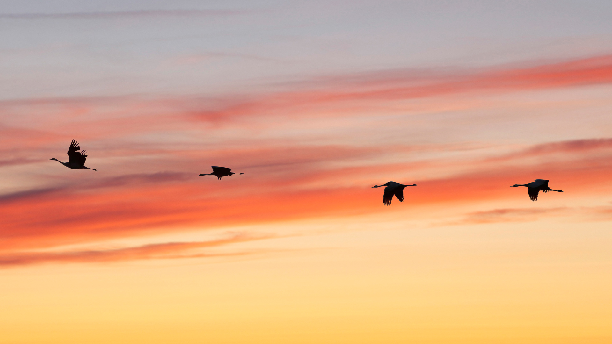
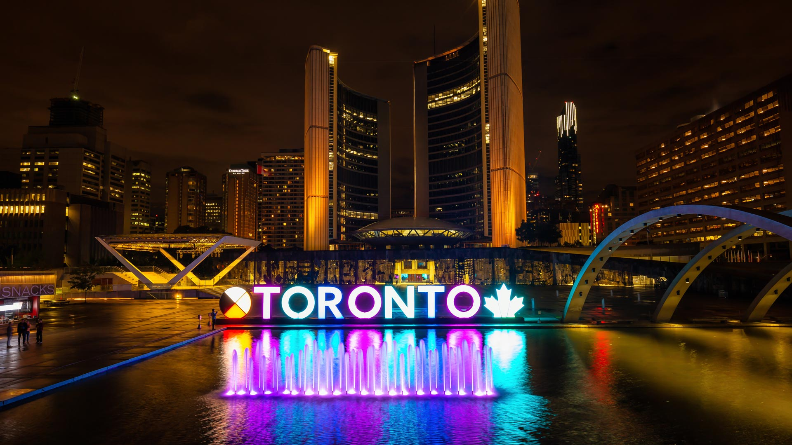
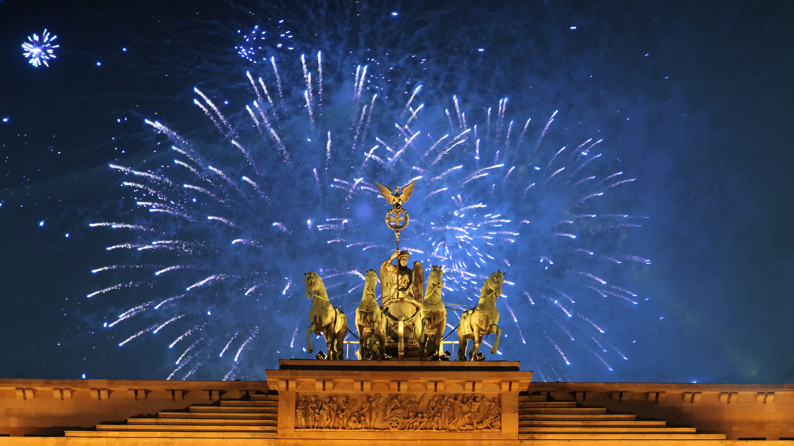
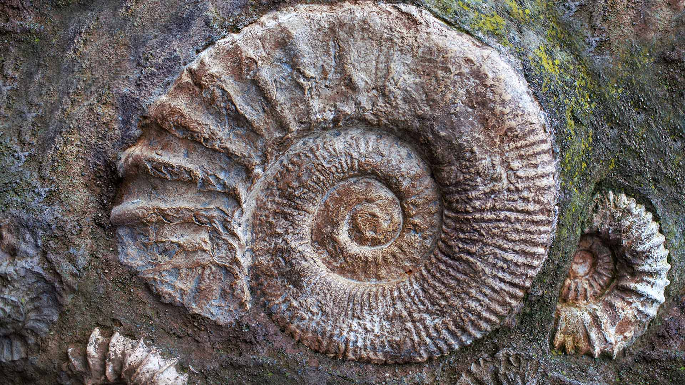
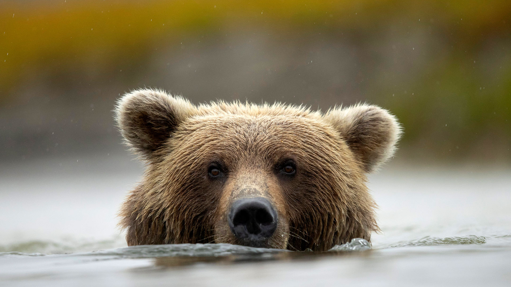
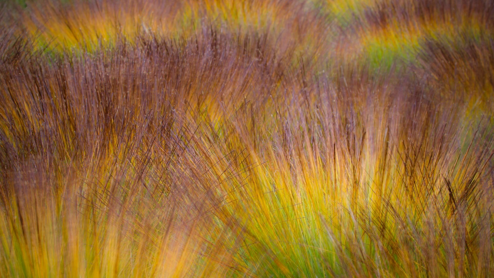
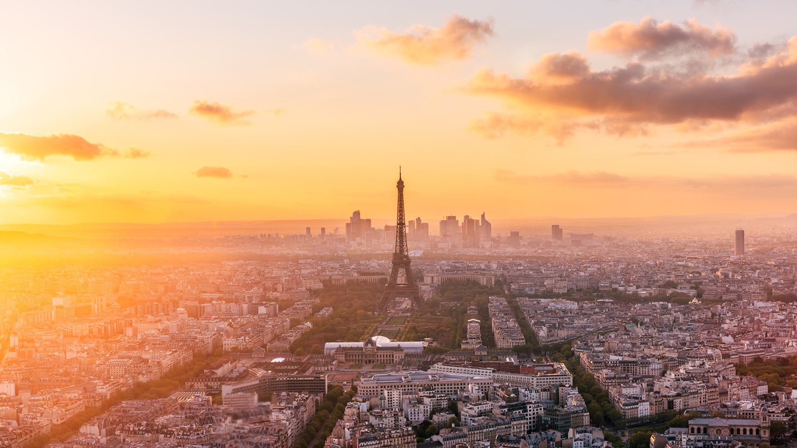

#### 20261004 Grues cendrées en vol à l'aube, lac du Der, France (© Christophe Lehenaff/Getty Images)

#### 20261004 阿尔忒弥斯1号月球火箭，39B发射台，肯尼迪航天中心，佛罗里达州，2022年6月15日 (© EVA MARIE UZCATEGUI/Getty Images)

#### 20261003 Toronto City Hall illuminated at night (© EB Adventure Photography/Shutterstock)

#### 20261003 Brandenburger Tor, Berlin (© almir1968/Getty Images)

#### 20261003 アンモナイトの化石 (© J Nemchinova/Getty Images)

#### 20261002 Brown bear in Silver Salmon Creek, Lake Clark National Park and Preserve, Alaska (© Danny Green/Nature Picture Library)

#### 20261002 Chattooga River in the Appalachian Mountains, North Carolina (© mtilghma/Getty Images)

#### 20261002 Végétation automnale multicolore sur la tourbière (© Utopia_88/Getty Images)

#### 20261001 La tour Eiffel au coucher de soleil, Paris (© Alexander Spatari/Getty Images)

#### 20261001 Sunset from Olmsted Point, Yosemite National Park, California, USA (© Robb Hirsch/Tandem Stills + Motion)

